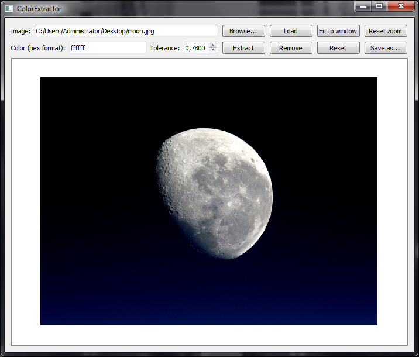
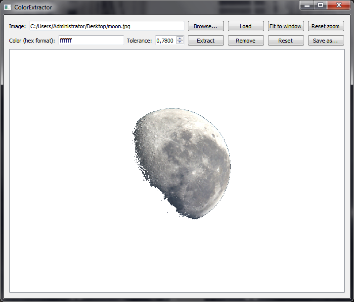
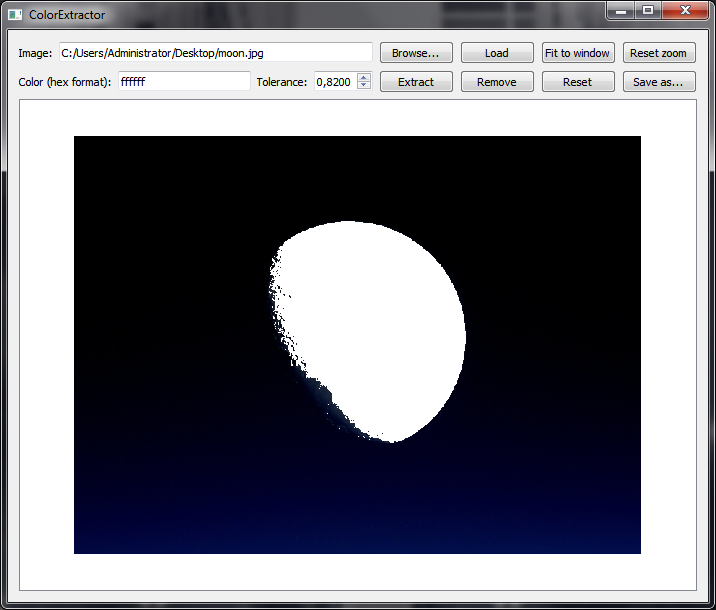

# ColorExtractor
Color extractor that can be used to extract or remove a certain color from an image. An error tolerance may also be set. Written in Qt/C++.

## Download
Download link: [Win32 binary](https://github.com/Extender/ColorExtractor/raw/master/bin/colorextractor-v1.0-bin-win32.zip)

## Screenshots

### Input

### Output (#FFFFFF extracted, tolerance 78%)

### Output (#FFFFFF removed, tolerance 82%)

